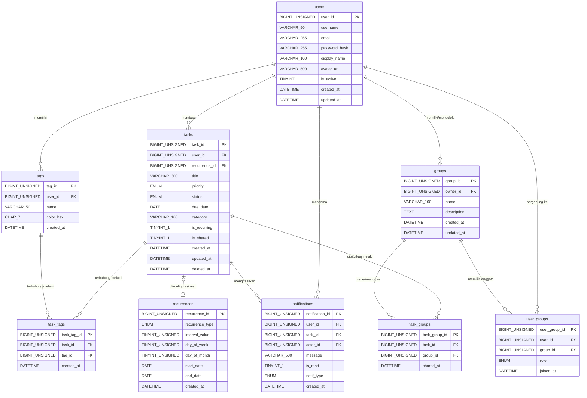

# ERD & Desain Database — ImTrack

> **Aplikasi:** ImTrack — Task Management / Todo List
> **Tech Stack Frontend:** React + TypeScript + Redux Toolkit
> **Backend API:** MockAPI.io (akan dikembangkan ke backend nyata)
> **Dibuat oleh:** Vincent
> **Tanggal:** 31 Agustus 2026

---

## 1. Identifikasi Entitas

Berdasarkan analisis kode aplikasi ImTrack di `src/types/task.ts`, `src/store/redux/taskSlice.ts`, `src/pages/`, dan `src/services/api/taskApi.ts`, berikut entitas yang teridentifikasi:

| No | Entitas | Deskripsi |
|----|---------|-----------|
| 1 | `users` | Pengguna yang mendaftar dan login ke aplikasi |
| 2 | `tasks` | Tugas utama yang dibuat oleh pengguna |
| 3 | `tags` | Label/kategori yang dapat ditempel pada tugas |
| 4 | `task_tags` | Tabel pivot relasi many-to-many antara tasks dan tags |
| 5 | `groups` | Kelompok/grup tempat tugas dapat dibagikan |
| 6 | `user_groups` | Tabel pivot relasi many-to-many antara users dan groups |
| 7 | `task_groups` | Tabel pivot relasi many-to-many antara tasks dan groups |
| 8 | `notifications` | Notifikasi yang dikirim ke pengguna |
| 9 | `recurrences` | Konfigurasi pengulangan tugas berkala |

---

## 2. Atribut Tiap Entitas

### 2.1 Tabel `users`

| Atribut | Tipe Data | Constraint | Keterangan |
|---------|-----------|------------|------------|
| `user_id` | `BIGINT UNSIGNED` | `PRIMARY KEY AUTO_INCREMENT` | Identitas unik pengguna |
| `username` | `VARCHAR(50)` | `NOT NULL UNIQUE` | Nama pengguna untuk login |
| `email` | `VARCHAR(255)` | `NOT NULL UNIQUE` | Alamat email pengguna |
| `password_hash` | `VARCHAR(255)` | `NOT NULL` | Password yang sudah di-hash (bcrypt) |
| `display_name` | `VARCHAR(100)` | `NULL` | Nama tampilan di UI |
| `avatar_url` | `VARCHAR(500)` | `NULL` | URL foto profil pengguna |
| `is_active` | `TINYINT(1)` | `NOT NULL DEFAULT 1` | Status aktif akun (1=aktif, 0=nonaktif) |
| `created_at` | `DATETIME` | `NOT NULL DEFAULT CURRENT_TIMESTAMP` | Waktu akun dibuat |
| `updated_at` | `DATETIME` | `NOT NULL DEFAULT CURRENT_TIMESTAMP ON UPDATE CURRENT_TIMESTAMP` | Waktu data terakhir diperbarui |

### 2.2 Tabel `tasks`

| Atribut | Tipe Data | Constraint | Keterangan |
|---------|-----------|------------|------------|
| `task_id` | `BIGINT UNSIGNED` | `PRIMARY KEY AUTO_INCREMENT` | Identitas unik tugas |
| `user_id` | `BIGINT UNSIGNED` | `NOT NULL, FK → users(user_id)` | Pemilik tugas |
| `recurrence_id` | `BIGINT UNSIGNED` | `NULL, FK → recurrences(recurrence_id)` | Referensi ke pengulangan (opsional) |
| `title` | `VARCHAR(300)` | `NOT NULL` | Judul/nama tugas |
| `priority` | `ENUM('Sekarang','Nanti','Someday')` | `NOT NULL DEFAULT 'Nanti'` | Tingkat prioritas tugas |
| `status` | `ENUM('todo','done')` | `NOT NULL DEFAULT 'todo'` | Status penyelesaian tugas |
| `due_date` | `DATE` | `NULL` | Tanggal jatuh tempo tugas |
| `category` | `VARCHAR(100)` | `NULL` | Kategori tugas (misal: Pekerjaan, Personal) |
| `is_recurring` | `TINYINT(1)` | `NOT NULL DEFAULT 0` | Flag apakah tugas berulang |
| `is_shared` | `TINYINT(1)` | `NOT NULL DEFAULT 0` | Flag apakah tugas dibagikan ke grup |
| `created_at` | `DATETIME` | `NOT NULL DEFAULT CURRENT_TIMESTAMP` | Waktu tugas dibuat |
| `updated_at` | `DATETIME` | `NOT NULL DEFAULT CURRENT_TIMESTAMP ON UPDATE CURRENT_TIMESTAMP` | Waktu tugas terakhir diperbarui |
| `deleted_at` | `DATETIME` | `NULL` | Soft delete — NULL berarti belum dihapus |

### 2.3 Tabel `tags`

| Atribut | Tipe Data | Constraint | Keterangan |
|---------|-----------|------------|------------|
| `tag_id` | `BIGINT UNSIGNED` | `PRIMARY KEY AUTO_INCREMENT` | Identitas unik tag |
| `user_id` | `BIGINT UNSIGNED` | `NOT NULL, FK → users(user_id)` | Pemilik tag |
| `name` | `VARCHAR(50)` | `NOT NULL` | Nama tag (misal: urgent, meeting, coding) |
| `color_hex` | `CHAR(7)` | `NULL DEFAULT '#6B7280'` | Warna tag dalam format HEX |
| `created_at` | `DATETIME` | `NOT NULL DEFAULT CURRENT_TIMESTAMP` | Waktu tag dibuat |

### 2.4 Tabel `task_tags` (Pivot)

| Atribut | Tipe Data | Constraint | Keterangan |
|---------|-----------|------------|------------|
| `task_tag_id` | `BIGINT UNSIGNED` | `PRIMARY KEY AUTO_INCREMENT` | Identitas unik baris pivot |
| `task_id` | `BIGINT UNSIGNED` | `NOT NULL, FK → tasks(task_id)` | Referensi ke tugas |
| `tag_id` | `BIGINT UNSIGNED` | `NOT NULL, FK → tags(tag_id)` | Referensi ke tag |
| `created_at` | `DATETIME` | `NOT NULL DEFAULT CURRENT_TIMESTAMP` | Waktu relasi dibuat |

### 2.5 Tabel `groups`

| Atribut | Tipe Data | Constraint | Keterangan |
|---------|-----------|------------|------------|
| `group_id` | `BIGINT UNSIGNED` | `PRIMARY KEY AUTO_INCREMENT` | Identitas unik grup |
| `owner_id` | `BIGINT UNSIGNED` | `NOT NULL, FK → users(user_id)` | Pembuat/pemilik grup |
| `name` | `VARCHAR(100)` | `NOT NULL` | Nama grup |
| `description` | `TEXT` | `NULL` | Deskripsi singkat tentang grup |
| `created_at` | `DATETIME` | `NOT NULL DEFAULT CURRENT_TIMESTAMP` | Waktu grup dibuat |
| `updated_at` | `DATETIME` | `NOT NULL DEFAULT CURRENT_TIMESTAMP ON UPDATE CURRENT_TIMESTAMP` | Waktu data grup diperbarui |

### 2.6 Tabel `user_groups` (Pivot)

| Atribut | Tipe Data | Constraint | Keterangan |
|---------|-----------|------------|------------|
| `user_group_id` | `BIGINT UNSIGNED` | `PRIMARY KEY AUTO_INCREMENT` | Identitas unik baris pivot |
| `user_id` | `BIGINT UNSIGNED` | `NOT NULL, FK → users(user_id)` | Referensi ke pengguna |
| `group_id` | `BIGINT UNSIGNED` | `NOT NULL, FK → groups(group_id)` | Referensi ke grup |
| `role` | `ENUM('admin','member')` | `NOT NULL DEFAULT 'member'` | Peran anggota dalam grup |
| `joined_at` | `DATETIME` | `NOT NULL DEFAULT CURRENT_TIMESTAMP` | Waktu bergabung ke grup |

### 2.7 Tabel `task_groups` (Pivot)

| Atribut | Tipe Data | Constraint | Keterangan |
|---------|-----------|------------|------------|
| `task_group_id` | `BIGINT UNSIGNED` | `PRIMARY KEY AUTO_INCREMENT` | Identitas unik baris pivot |
| `task_id` | `BIGINT UNSIGNED` | `NOT NULL, FK → tasks(task_id)` | Referensi ke tugas |
| `group_id` | `BIGINT UNSIGNED` | `NOT NULL, FK → groups(group_id)` | Referensi ke grup |
| `shared_at` | `DATETIME` | `NOT NULL DEFAULT CURRENT_TIMESTAMP` | Waktu tugas dibagikan ke grup |

### 2.8 Tabel `notifications`

| Atribut | Tipe Data | Constraint | Keterangan |
|---------|-----------|------------|------------|
| `notification_id` | `BIGINT UNSIGNED` | `PRIMARY KEY AUTO_INCREMENT` | Identitas unik notifikasi |
| `user_id` | `BIGINT UNSIGNED` | `NOT NULL, FK → users(user_id)` | Penerima notifikasi |
| `task_id` | `BIGINT UNSIGNED` | `NULL, FK → tasks(task_id)` | Tugas terkait (opsional) |
| `actor_id` | `BIGINT UNSIGNED` | `NULL, FK → users(user_id)` | Pengguna yang memicu notifikasi |
| `message` | `VARCHAR(500)` | `NOT NULL` | Isi pesan notifikasi |
| `is_read` | `TINYINT(1)` | `NOT NULL DEFAULT 0` | Status sudah dibaca (1=sudah, 0=belum) |
| `notif_type` | `ENUM('task_assigned','task_due','mention','system')` | `NOT NULL DEFAULT 'system'` | Jenis notifikasi |
| `created_at` | `DATETIME` | `NOT NULL DEFAULT CURRENT_TIMESTAMP` | Waktu notifikasi dibuat |

### 2.9 Tabel `recurrences`

| Atribut | Tipe Data | Constraint | Keterangan |
|---------|-----------|------------|------------|
| `recurrence_id` | `BIGINT UNSIGNED` | `PRIMARY KEY AUTO_INCREMENT` | Identitas unik pengulangan |
| `recurrence_type` | `ENUM('daily','weekly','monthly')` | `NOT NULL` | Jenis pengulangan |
| `interval_value` | `TINYINT UNSIGNED` | `NOT NULL DEFAULT 1` | Interval pengulangan (misal: setiap 2 hari) |
| `day_of_week` | `TINYINT UNSIGNED` | `NULL` | Hari dalam seminggu (0=Minggu, 6=Sabtu) — untuk weekly |
| `day_of_month` | `TINYINT UNSIGNED` | `NULL` | Tanggal dalam sebulan 1–31 — untuk monthly |
| `start_date` | `DATE` | `NOT NULL` | Tanggal mulai pengulangan |
| `end_date` | `DATE` | `NULL` | Tanggal akhir pengulangan (NULL = selamanya) |
| `created_at` | `DATETIME` | `NOT NULL DEFAULT CURRENT_TIMESTAMP` | Waktu konfigurasi dibuat |

---

## 3. Diagram ERD (Entity Relationship Diagram)



---

## 4. Penjelasan Relasi Antar Entitas

| Relasi | Jenis | Keterangan |
|--------|-------|------------|
| `users` → `tasks` | **One-to-Many (1:N)** | Satu pengguna dapat memiliki banyak tugas; setiap tugas hanya dimiliki oleh satu pengguna |
| `users` → `tags` | **One-to-Many (1:N)** | Satu pengguna dapat membuat banyak tag; setiap tag dimiliki satu pengguna |
| `tasks` ↔ `tags` | **Many-to-Many (M:N)** | Satu tugas dapat memiliki banyak tag; satu tag dapat digunakan di banyak tugas — dihubungkan via `task_tags` |
| `users` ↔ `groups` | **Many-to-Many (M:N)** | Satu pengguna dapat bergabung ke banyak grup; satu grup dapat memiliki banyak anggota — via `user_groups` |
| `tasks` ↔ `groups` | **Many-to-Many (M:N)** | Satu tugas dapat dibagikan ke banyak grup; satu grup dapat menerima banyak tugas — via `task_groups` |
| `tasks` → `recurrences` | **One-to-One (1:1)** | Satu tugas memiliki paling banyak satu konfigurasi pengulangan |
| `users` → `notifications` | **One-to-Many (1:N)** | Satu pengguna dapat menerima banyak notifikasi |
| `tasks` → `notifications` | **One-to-Many (1:N)** | Satu tugas dapat menghasilkan banyak notifikasi (jatuh tempo, assignment, dsb) |
| `users (actor)` → `notifications` | **One-to-Many (1:N)** | Satu pengguna dapat memicu banyak notifikasi pada pengguna lain |
| `users` → `groups` (owner) | **One-to-Many (1:N)** | Satu pengguna dapat memiliki/memimpin banyak grup |

---

## 5. Penjelasan Indexing

### 5.1 Tabel `users`

| Nama Indeks | Kolom | Jenis Indeks | Alasan |
|-------------|-------|-------------|--------|
| `PRIMARY` | `user_id` | **Primary Key (B-Tree)** | Identifikasi unik; otomatis diindeks oleh RDBMS |
| `idx_users_email` | `email` | **Single Index (UNIQUE)** | Login menggunakan email — query `WHERE email = ?` sangat sering dilakukan. Unique Index mencegah duplikasi email sekaligus mempercepat lookup O(log n) |
| `idx_users_username` | `username` | **Single Index (UNIQUE)** | Pencarian profil berdasarkan username; diperlukan untuk validasi unik saat registrasi |

### 5.2 Tabel `tasks`

| Nama Indeks | Kolom | Jenis Indeks | Alasan |
|-------------|-------|-------------|--------|
| `PRIMARY` | `task_id` | **Primary Key (B-Tree)** | Identifikasi unik tugas |
| `idx_tasks_user_id` | `user_id` | **Single Index** | Paling sering diquery: `WHERE user_id = ?` untuk mengambil semua tugas milik pengguna tertentu |
| `idx_tasks_user_status` | `(user_id, status)` | **Composite Index** | Query dashboard: `WHERE user_id = ? AND status = 'todo'` — composite index mengikuti aturan LEFT-MOST prefix, lebih optimal dari dua single index terpisah |
| `idx_tasks_user_priority` | `(user_id, priority)` | **Composite Index** | Filter tugas berdasarkan prioritas per pengguna (Sekarang/Nanti/Someday) secara efisien |
| `idx_tasks_due_date` | `due_date` | **Single Index** | Fitur pengingat jatuh tempo: query `WHERE due_date = CURDATE()` oleh scheduler/cron job |
| `idx_tasks_deleted_at` | `deleted_at` | **Single Index** | Mendukung soft delete — query `WHERE deleted_at IS NULL` untuk menyaring tugas aktif |

### 5.3 Tabel `tags`

| Nama Indeks | Kolom | Jenis Indeks | Alasan |
|-------------|-------|-------------|--------|
| `PRIMARY` | `tag_id` | **Primary Key** | Identifikasi unik tag |
| `idx_tags_user_id` | `user_id` | **Single Index** | Mengambil semua tag milik seorang pengguna |
| `uq_tags_user_name` | `(user_id, name)` | **Composite Unique Index** | Satu pengguna tidak boleh memiliki dua tag dengan nama sama — mencegah duplikasi dan mempercepat pencarian tag berdasarkan nama per user |

### 5.4 Tabel `task_tags`

| Nama Indeks | Kolom | Jenis Indeks | Alasan |
|-------------|-------|-------------|--------|
| `PRIMARY` | `task_tag_id` | **Primary Key** | Identifikasi unik baris |
| `uq_task_tag` | `(task_id, tag_id)` | **Composite Unique Index** | Mencegah duplikasi relasi task-tag yang sama; mempercepat JOIN antara tasks dan tags |
| `idx_task_tags_tag_id` | `tag_id` | **Single Index** | Lookup terbalik: mencari semua tugas yang memiliki tag tertentu |

### 5.5 Tabel `groups`

| Nama Indeks | Kolom | Jenis Indeks | Alasan |
|-------------|-------|-------------|--------|
| `PRIMARY` | `group_id` | **Primary Key** | Identifikasi unik grup |
| `idx_groups_owner_id` | `owner_id` | **Single Index** | Mengambil semua grup yang dimiliki seorang pengguna |

### 5.6 Tabel `user_groups`

| Nama Indeks | Kolom | Jenis Indeks | Alasan |
|-------------|-------|-------------|--------|
| `PRIMARY` | `user_group_id` | **Primary Key** | Identifikasi unik baris |
| `uq_user_group` | `(user_id, group_id)` | **Composite Unique Index** | Satu pengguna hanya dapat bergabung sekali ke grup yang sama; mempercepat query membership check |
| `idx_user_groups_group_id` | `group_id` | **Single Index** | Lookup anggota berdasarkan grup — dipakai saat menampilkan daftar anggota |

### 5.7 Tabel `task_groups`

| Nama Indeks | Kolom | Jenis Indeks | Alasan |
|-------------|-------|-------------|--------|
| `PRIMARY` | `task_group_id` | **Primary Key** | Identifikasi unik baris |
| `uq_task_group` | `(task_id, group_id)` | **Composite Unique Index** | Mencegah tugas dibagikan dua kali ke grup yang sama |
| `idx_task_groups_group_id` | `group_id` | **Single Index** | Mengambil semua tugas dalam sebuah grup — dipakai di halaman grup |

### 5.8 Tabel `notifications`

| Nama Indeks | Kolom | Jenis Indeks | Alasan |
|-------------|-------|-------------|--------|
| `PRIMARY` | `notification_id` | **Primary Key** | Identifikasi unik notifikasi |
| `idx_notif_user_read` | `(user_id, is_read)` | **Composite Index** | Query notifikasi belum dibaca per pengguna: `WHERE user_id = ? AND is_read = 0` — paling sering dipakai di badge notifikasi topbar |
| `idx_notif_created_at` | `created_at` | **Single Index** | Pengurutan notifikasi berdasarkan waktu terbaru (`ORDER BY created_at DESC`) |

### 5.9 Tabel `recurrences`

| Nama Indeks | Kolom | Jenis Indeks | Alasan |
|-------------|-------|-------------|--------|
| `PRIMARY` | `recurrence_id` | **Primary Key** | Identifikasi unik konfigurasi pengulangan |
| `idx_recurrences_type` | `recurrence_type` | **Single Index** | Filter pengulangan berdasarkan jenisnya (daily/weekly/monthly) untuk job scheduler |

---

## 6. Penjelasan Tipe Data

### 6.1 Integer / Numeric

| Tipe Data | Digunakan Pada | Alasan Pemilihan |
|-----------|----------------|-----------------|
| `BIGINT UNSIGNED` | Semua kolom PK dan FK | Mendukung nilai 0 hingga ~18.4 quintiliun (2⁶⁴−1). Dipilih karena aplikasi dapat tumbuh besar sehingga `INT UNSIGNED` (max ~4.29 miliar) berisiko overflow. `UNSIGNED` dipilih karena ID tidak pernah negatif, menggandakan kapasitas positif dibanding `BIGINT` signed |
| `TINYINT(1)` | `is_active`, `is_read`, `is_recurring`, `is_shared` | Konvensi MySQL untuk boolean (nilai 0 atau 1). Hanya membutuhkan 1 byte storage — jauh lebih efisien dari `INT` (4 byte) |
| `TINYINT UNSIGNED` | `interval_value`, `day_of_week`, `day_of_month` | Nilai kecil yang tidak pernah negatif: interval (1–365), day_of_week (0–6), day_of_month (1–31). Range 0–255 sudah cukup, hanya 1 byte storage |

### 6.2 String / Character

| Tipe Data | Digunakan Pada | Alasan Pemilihan |
|-----------|----------------|-----------------|
| `VARCHAR(50)` | `username`, `tags.name` | Nama pengguna dan tag biasanya pendek. VARCHAR menyimpan panjang aktual (hemat storage) berbeda dari CHAR yang fixed-length |
| `VARCHAR(100)` | `display_name`, `groups.name`, `tasks.category` | Nama tampilan dan nama grup sedikit lebih panjang dari username, namun dibatasi agar tidak memuat teks panjang |
| `VARCHAR(255)` | `email`, `password_hash` | Email standar maksimal 254 karakter (RFC 5321). Hash bcrypt menghasilkan 60 karakter; VARCHAR(255) memberikan fleksibilitas untuk algoritma hash lain di masa depan tanpa perlu migrasi skema |
| `VARCHAR(300)` | `tasks.title` | Judul tugas bisa lebih panjang dari nama biasa, namun dibatasi agar tidak memuat paragraf penuh |
| `VARCHAR(500)` | `notifications.message`, `users.avatar_url` | Pesan notifikasi dan URL foto profil bisa cukup panjang; 500 karakter memberikan ruang yang cukup tanpa berlebihan |
| `CHAR(7)` | `tags.color_hex` | Format HEX color selalu tepat 7 karakter (`#RRGGBB`). CHAR lebih efisien dari VARCHAR untuk string dengan panjang tetap karena tidak menyimpan overhead panjang |
| `TEXT` | `groups.description` | Deskripsi grup tidak terbatas panjangnya dan disimpan di luar row storage oleh MySQL InnoDB — tepat untuk konten panjang yang jarang muncul di klausa WHERE |

### 6.3 Date / Time

| Tipe Data | Digunakan Pada | Alasan Pemilihan |
|-----------|----------------|-----------------|
| `DATE` | `due_date`, `start_date`, `end_date` | Hanya membutuhkan tanggal (tahun-bulan-hari) tanpa waktu. DATE lebih efisien (3 byte) dibanding DATETIME (8 byte). TIMESTAMP dihindari karena terbatas hingga tahun 2038 (Y2K38 problem) |
| `DATETIME` | `created_at`, `updated_at`, `deleted_at`, `joined_at`, dll. | DATETIME dipilih daripada TIMESTAMP karena: (1) tidak terbatas tahun 2038, (2) menyimpan nilai absolut tidak bergantung timezone server, (3) nilai tidak berubah jika timezone server berubah. Sangat cocok untuk audit trail |

### 6.4 ENUM

| Tipe Data | Digunakan Pada | Nilai yang Valid | Alasan Pemilihan |
|-----------|----------------|-----------------|-----------------|
| `ENUM('Sekarang','Nanti','Someday')` | `tasks.priority` | Sesuai kode frontend TypeScript | ENUM lebih efisien dari VARCHAR untuk nilai tetap — disimpan sebagai integer 1–2 byte secara internal. Constraint otomatis di level database mencegah nilai tidak valid |
| `ENUM('todo','done')` | `tasks.status` | Sesuai kode frontend TypeScript | Sama seperti priority — hanya dua nilai valid, ENUM adalah pilihan paling tepat |
| `ENUM('daily','weekly','monthly')` | `recurrences.recurrence_type` | Sesuai `recurrenceType` di TypeScript interface | Membatasi nilai jenis pengulangan secara ketat di level database |
| `ENUM('admin','member')` | `user_groups.role` | Dua peran dalam grup | ENUM menjamin integritas nilai role tanpa perlu tabel lookup terpisah |
| `ENUM('task_assigned','task_due','mention','system')` | `notifications.notif_type` | Empat jenis notifikasi | Membatasi jenis notifikasi yang valid sesuai kebutuhan bisnis |

---

## 7. Penerapan Naming Convention

Seluruh penamaan dalam desain database ini mengikuti kaidah berikut:

### 7.1 Aturan Umum

| Aturan | Contoh Benar | Contoh Salah |
|--------|-------------|--------------|
| **snake_case** untuk semua nama tabel dan kolom | `task_id`, `created_at`, `user_groups` | `taskId`, `CreatedAt`, `UserGroups` |
| **Plural** untuk nama tabel entitas utama | `users`, `tasks`, `notifications` | `user`, `task`, `notification` |
| **Singular gabungan dua entitas** untuk tabel pivot | `task_tags`, `user_groups` | `tasks_tags`, `users_groups` |
| Primary key menggunakan format `{singular_tabel}_id` | `user_id`, `task_id`, `group_id` | `id`, `ID`, `taskID` |
| Foreign key menggunakan nama yang sama dengan PK asalnya | `user_id` (FK di tasks merujuk ke `users.user_id`) | `uid`, `userId`, `user_fk` |
| Boolean/flag columns dimulai dengan prefix `is_` | `is_active`, `is_read`, `is_recurring` | `active`, `read`, `recurring` |
| Timestamp menggunakan suffix `_at` | `created_at`, `updated_at`, `deleted_at` | `created`, `createTime`, `ts` |
| ENUM values menggunakan `lowercase` konsisten | `'todo'`, `'done'`, `'daily'` | `'TODO'`, `'Done'`, `'Daily'` |
| Index diberi nama deskriptif dengan prefix `idx_` | `idx_tasks_user_id`, `idx_notif_user_read` | `index1`, `i1` |
| Unique index diberi nama dengan prefix `uq_` | `uq_task_tag`, `uq_user_group` | `unique1`, `uniq_task` |
| Constraint FK diberi nama dengan prefix `fk_` | `fk_tasks_user`, `fk_tt_tag` | `foreign1`, `task_fk` |

### 7.2 Mapping TypeScript Frontend → SQL Database

| TypeScript (Frontend) | SQL (Database) | Keterangan |
|-----------------------|---------------|------------|
| `Task.id` | `tasks.task_id` | Diubah ke format `{entity}_id` untuk konsistensi PK |
| `Task.title` | `tasks.title` | Identik |
| `Task.priority` | `tasks.priority` | Identik — nilai ENUM sama persis |
| `Task.status` | `tasks.status` | Identik — `'todo'` dan `'done'` |
| `Task.due` | `tasks.due_date` | Diperpanjang menjadi lebih deskriptif |
| `Task.tags` (array string) | `task_tags` + `tags` | Dinormalisasi ke tabel relasional terpisah |
| `Task.cat` | `tasks.category` | Diubah dari singkatan ke nama lengkap |
| `Task.isRecurring` | `tasks.is_recurring` | camelCase → snake_case, ditambah prefix `is_` |
| `Task.recurrenceType` | `recurrences.recurrence_type` | Dipindah ke tabel `recurrences` yang terpisah |
| `Group.id` | `groups.group_id` | Format standar PK |
| `Group.name` | `groups.name` | Identik |
| `Notification.id` | `notifications.notification_id` | Format standar PK |
| `Notification.text` | `notifications.message` | Diubah menjadi lebih deskriptif |
| `Notification.time` | `notifications.created_at` | Menggunakan DATETIME standar audit trail |
| `Notification.read` | `notifications.is_read` | Ditambah prefix `is_` untuk boolean |

---

## 8. SQL DDL — Preparation Database

```sql
-- ============================================================
--  ImTrack Database Schema
--  Database  : MySQL 8.x / MariaDB 10.6+
--  Encoding  : utf8mb4  (mendukung emoji & Unicode penuh)
--  Collation : utf8mb4_unicode_ci
-- ============================================================

CREATE DATABASE IF NOT EXISTS imtrack_db
  CHARACTER SET utf8mb4
  COLLATE utf8mb4_unicode_ci;

USE imtrack_db;

-- ─────────────────────────────────────────────────────────────
--  1. TABLE: users
-- ─────────────────────────────────────────────────────────────
CREATE TABLE users (
    user_id       BIGINT UNSIGNED  NOT NULL AUTO_INCREMENT,
    username      VARCHAR(50)      NOT NULL,
    email         VARCHAR(255)     NOT NULL,
    password_hash VARCHAR(255)     NOT NULL,
    display_name  VARCHAR(100)     NULL,
    avatar_url    VARCHAR(500)     NULL,
    is_active     TINYINT(1)       NOT NULL DEFAULT 1,
    created_at    DATETIME         NOT NULL DEFAULT CURRENT_TIMESTAMP,
    updated_at    DATETIME         NOT NULL DEFAULT CURRENT_TIMESTAMP
                                   ON UPDATE CURRENT_TIMESTAMP,

    CONSTRAINT pk_users          PRIMARY KEY (user_id),
    CONSTRAINT uq_users_email    UNIQUE      (email),
    CONSTRAINT uq_users_username UNIQUE      (username)
) ENGINE=InnoDB DEFAULT CHARSET=utf8mb4 COLLATE=utf8mb4_unicode_ci;

CREATE INDEX idx_users_email    ON users (email);
CREATE INDEX idx_users_username ON users (username);

-- ─────────────────────────────────────────────────────────────
--  2. TABLE: recurrences
-- ─────────────────────────────────────────────────────────────
CREATE TABLE recurrences (
    recurrence_id   BIGINT UNSIGNED  NOT NULL AUTO_INCREMENT,
    recurrence_type ENUM('daily','weekly','monthly') NOT NULL,
    interval_value  TINYINT UNSIGNED NOT NULL DEFAULT 1,
    day_of_week     TINYINT UNSIGNED NULL  COMMENT '0=Minggu, 1=Senin, ..., 6=Sabtu',
    day_of_month    TINYINT UNSIGNED NULL  COMMENT '1–31',
    start_date      DATE             NOT NULL,
    end_date        DATE             NULL,
    created_at      DATETIME         NOT NULL DEFAULT CURRENT_TIMESTAMP,

    CONSTRAINT pk_recurrences PRIMARY KEY (recurrence_id)
) ENGINE=InnoDB DEFAULT CHARSET=utf8mb4 COLLATE=utf8mb4_unicode_ci;

CREATE INDEX idx_recurrences_type ON recurrences (recurrence_type);

-- ─────────────────────────────────────────────────────────────
--  3. TABLE: tasks
-- ─────────────────────────────────────────────────────────────
CREATE TABLE tasks (
    task_id       BIGINT UNSIGNED  NOT NULL AUTO_INCREMENT,
    user_id       BIGINT UNSIGNED  NOT NULL,
    recurrence_id BIGINT UNSIGNED  NULL,
    title         VARCHAR(300)     NOT NULL,
    priority      ENUM('Sekarang','Nanti','Someday') NOT NULL DEFAULT 'Nanti',
    status        ENUM('todo','done')                NOT NULL DEFAULT 'todo',
    due_date      DATE             NULL,
    category      VARCHAR(100)     NULL,
    is_recurring  TINYINT(1)       NOT NULL DEFAULT 0,
    is_shared     TINYINT(1)       NOT NULL DEFAULT 0,
    created_at    DATETIME         NOT NULL DEFAULT CURRENT_TIMESTAMP,
    updated_at    DATETIME         NOT NULL DEFAULT CURRENT_TIMESTAMP
                                   ON UPDATE CURRENT_TIMESTAMP,
    deleted_at    DATETIME         NULL  COMMENT 'NULL = aktif (soft delete)',

    CONSTRAINT pk_tasks            PRIMARY KEY (task_id),
    CONSTRAINT fk_tasks_user       FOREIGN KEY (user_id)
        REFERENCES users       (user_id)       ON DELETE CASCADE  ON UPDATE CASCADE,
    CONSTRAINT fk_tasks_recurrence FOREIGN KEY (recurrence_id)
        REFERENCES recurrences (recurrence_id) ON DELETE SET NULL ON UPDATE CASCADE
) ENGINE=InnoDB DEFAULT CHARSET=utf8mb4 COLLATE=utf8mb4_unicode_ci;

CREATE INDEX idx_tasks_user_id       ON tasks (user_id);
CREATE INDEX idx_tasks_user_status   ON tasks (user_id, status);
CREATE INDEX idx_tasks_user_priority ON tasks (user_id, priority);
CREATE INDEX idx_tasks_due_date      ON tasks (due_date);
CREATE INDEX idx_tasks_deleted_at    ON tasks (deleted_at);

-- ─────────────────────────────────────────────────────────────
--  4. TABLE: tags
-- ─────────────────────────────────────────────────────────────
CREATE TABLE tags (
    tag_id     BIGINT UNSIGNED  NOT NULL AUTO_INCREMENT,
    user_id    BIGINT UNSIGNED  NOT NULL,
    name       VARCHAR(50)      NOT NULL,
    color_hex  CHAR(7)          NULL DEFAULT '#6B7280',
    created_at DATETIME         NOT NULL DEFAULT CURRENT_TIMESTAMP,

    CONSTRAINT pk_tags           PRIMARY KEY (tag_id),
    CONSTRAINT fk_tags_user      FOREIGN KEY (user_id)
        REFERENCES users (user_id) ON DELETE CASCADE ON UPDATE CASCADE,
    CONSTRAINT uq_tags_user_name UNIQUE (user_id, name)
) ENGINE=InnoDB DEFAULT CHARSET=utf8mb4 COLLATE=utf8mb4_unicode_ci;

CREATE INDEX idx_tags_user_id ON tags (user_id);

-- ─────────────────────────────────────────────────────────────
--  5. TABLE: task_tags  (pivot tasks <-> tags)
-- ─────────────────────────────────────────────────────────────
CREATE TABLE task_tags (
    task_tag_id BIGINT UNSIGNED  NOT NULL AUTO_INCREMENT,
    task_id     BIGINT UNSIGNED  NOT NULL,
    tag_id      BIGINT UNSIGNED  NOT NULL,
    created_at  DATETIME         NOT NULL DEFAULT CURRENT_TIMESTAMP,

    CONSTRAINT pk_task_tags PRIMARY KEY (task_tag_id),
    CONSTRAINT fk_tt_task   FOREIGN KEY (task_id)
        REFERENCES tasks (task_id) ON DELETE CASCADE ON UPDATE CASCADE,
    CONSTRAINT fk_tt_tag    FOREIGN KEY (tag_id)
        REFERENCES tags  (tag_id)  ON DELETE CASCADE ON UPDATE CASCADE,
    CONSTRAINT uq_task_tag  UNIQUE (task_id, tag_id)
) ENGINE=InnoDB DEFAULT CHARSET=utf8mb4 COLLATE=utf8mb4_unicode_ci;

CREATE INDEX idx_task_tags_tag_id ON task_tags (tag_id);

-- ─────────────────────────────────────────────────────────────
--  6. TABLE: groups
-- ─────────────────────────────────────────────────────────────
CREATE TABLE groups (
    group_id    BIGINT UNSIGNED  NOT NULL AUTO_INCREMENT,
    owner_id    BIGINT UNSIGNED  NOT NULL,
    name        VARCHAR(100)     NOT NULL,
    description TEXT             NULL,
    created_at  DATETIME         NOT NULL DEFAULT CURRENT_TIMESTAMP,
    updated_at  DATETIME         NOT NULL DEFAULT CURRENT_TIMESTAMP
                                 ON UPDATE CURRENT_TIMESTAMP,

    CONSTRAINT pk_groups       PRIMARY KEY (group_id),
    CONSTRAINT fk_groups_owner FOREIGN KEY (owner_id)
        REFERENCES users (user_id) ON DELETE RESTRICT ON UPDATE CASCADE
) ENGINE=InnoDB DEFAULT CHARSET=utf8mb4 COLLATE=utf8mb4_unicode_ci;

CREATE INDEX idx_groups_owner_id ON groups (owner_id);

-- ─────────────────────────────────────────────────────────────
--  7. TABLE: user_groups  (pivot users <-> groups)
-- ─────────────────────────────────────────────────────────────
CREATE TABLE user_groups (
    user_group_id BIGINT UNSIGNED  NOT NULL AUTO_INCREMENT,
    user_id       BIGINT UNSIGNED  NOT NULL,
    group_id      BIGINT UNSIGNED  NOT NULL,
    role          ENUM('admin','member') NOT NULL DEFAULT 'member',
    joined_at     DATETIME         NOT NULL DEFAULT CURRENT_TIMESTAMP,

    CONSTRAINT pk_user_groups PRIMARY KEY (user_group_id),
    CONSTRAINT fk_ug_user     FOREIGN KEY (user_id)
        REFERENCES users   (user_id)   ON DELETE CASCADE ON UPDATE CASCADE,
    CONSTRAINT fk_ug_group    FOREIGN KEY (group_id)
        REFERENCES groups  (group_id)  ON DELETE CASCADE ON UPDATE CASCADE,
    CONSTRAINT uq_user_group  UNIQUE (user_id, group_id)
) ENGINE=InnoDB DEFAULT CHARSET=utf8mb4 COLLATE=utf8mb4_unicode_ci;

CREATE INDEX idx_user_groups_group_id ON user_groups (group_id);

-- ─────────────────────────────────────────────────────────────
--  8. TABLE: task_groups  (pivot tasks <-> groups)
-- ─────────────────────────────────────────────────────────────
CREATE TABLE task_groups (
    task_group_id BIGINT UNSIGNED  NOT NULL AUTO_INCREMENT,
    task_id       BIGINT UNSIGNED  NOT NULL,
    group_id      BIGINT UNSIGNED  NOT NULL,
    shared_at     DATETIME         NOT NULL DEFAULT CURRENT_TIMESTAMP,

    CONSTRAINT pk_task_groups PRIMARY KEY (task_group_id),
    CONSTRAINT fk_tg_task     FOREIGN KEY (task_id)
        REFERENCES tasks   (task_id)   ON DELETE CASCADE ON UPDATE CASCADE,
    CONSTRAINT fk_tg_group    FOREIGN KEY (group_id)
        REFERENCES groups  (group_id)  ON DELETE CASCADE ON UPDATE CASCADE,
    CONSTRAINT uq_task_group  UNIQUE (task_id, group_id)
) ENGINE=InnoDB DEFAULT CHARSET=utf8mb4 COLLATE=utf8mb4_unicode_ci;

CREATE INDEX idx_task_groups_group_id ON task_groups (group_id);

-- ─────────────────────────────────────────────────────────────
--  9. TABLE: notifications
-- ─────────────────────────────────────────────────────────────
CREATE TABLE notifications (
    notification_id BIGINT UNSIGNED  NOT NULL AUTO_INCREMENT,
    user_id         BIGINT UNSIGNED  NOT NULL,
    task_id         BIGINT UNSIGNED  NULL,
    actor_id        BIGINT UNSIGNED  NULL,
    message         VARCHAR(500)     NOT NULL,
    is_read         TINYINT(1)       NOT NULL DEFAULT 0,
    notif_type      ENUM('task_assigned','task_due','mention','system')
                                     NOT NULL DEFAULT 'system',
    created_at      DATETIME         NOT NULL DEFAULT CURRENT_TIMESTAMP,

    CONSTRAINT pk_notifications PRIMARY KEY (notification_id),
    CONSTRAINT fk_notif_user    FOREIGN KEY (user_id)
        REFERENCES users  (user_id)  ON DELETE CASCADE  ON UPDATE CASCADE,
    CONSTRAINT fk_notif_task    FOREIGN KEY (task_id)
        REFERENCES tasks  (task_id)  ON DELETE SET NULL ON UPDATE CASCADE,
    CONSTRAINT fk_notif_actor   FOREIGN KEY (actor_id)
        REFERENCES users  (user_id)  ON DELETE SET NULL ON UPDATE CASCADE
) ENGINE=InnoDB DEFAULT CHARSET=utf8mb4 COLLATE=utf8mb4_unicode_ci;

CREATE INDEX idx_notif_user_read  ON notifications (user_id, is_read);
CREATE INDEX idx_notif_created_at ON notifications (created_at);
```

---

## 9. Ringkasan Desain Database

```
imtrack_db
│
├── users               ← Pengguna (auth & profil)
├── recurrences         ← Konfigurasi pengulangan tugas
├── tasks               ← Tugas utama  (FK: users, recurrences)
│
├── tags                ← Label tugas  (FK: users)
├── task_tags           ← Pivot tasks ↔ tags  (M:N)
│
├── groups              ← Kelompok/tim  (FK: users sebagai owner)
├── user_groups         ← Pivot users ↔ groups  (M:N) + role
├── task_groups         ← Pivot tasks ↔ groups  (M:N)
│
└── notifications       ← Notifikasi  (FK: users, tasks, users as actor)
```

| Metrik | Nilai |
|--------|-------|
| **Total Tabel** | 9 |
| **Total Relasi (FK)** | 12 |
| **Tipe Relasi** | 4× One-to-Many, 3× Many-to-Many, 1× One-to-One |
| **Total Indeks Tambahan** | 18 (di luar PK) |
| **Indeks Composite** | 5 |
| **Indeks Unique** | 6 |
| **Engine** | InnoDB |
| **Charset** | utf8mb4 (Unicode penuh) |
